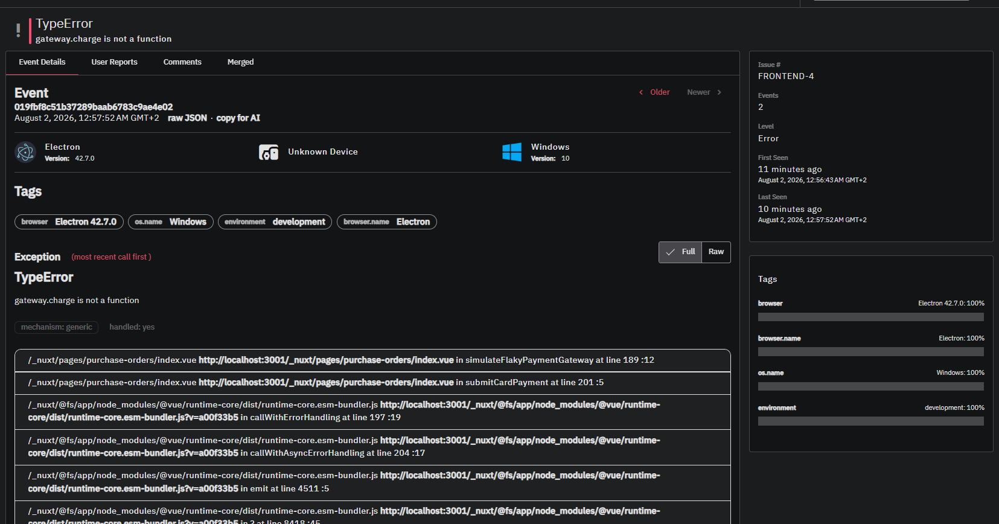
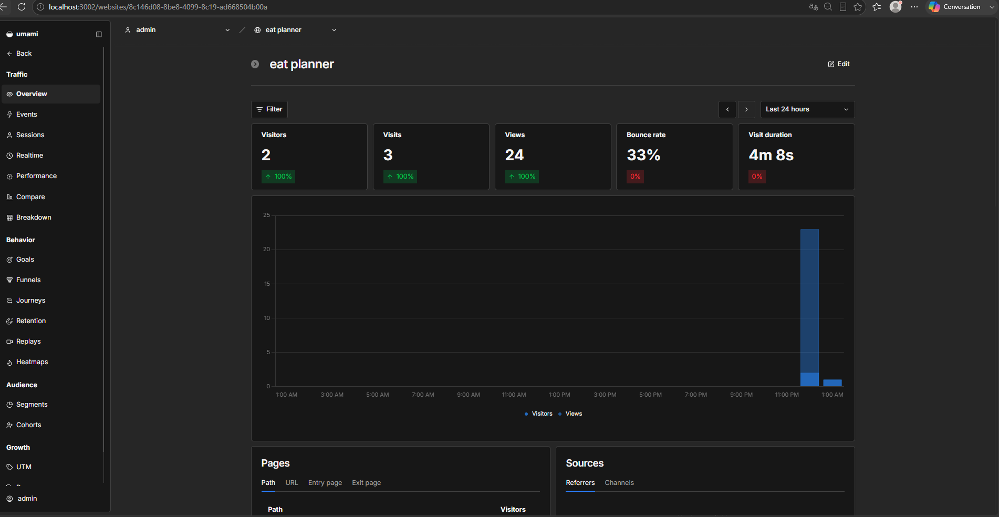
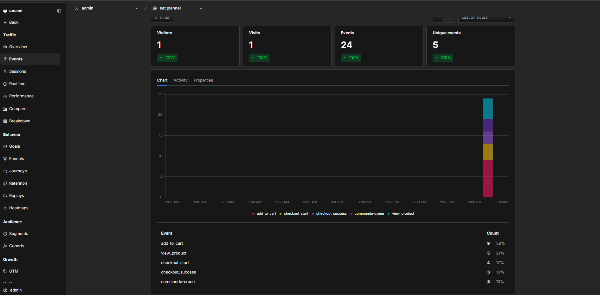
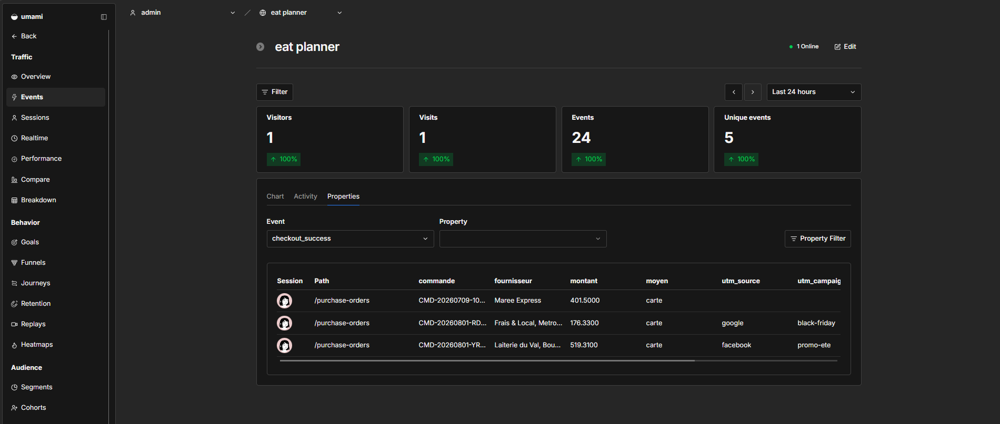

# Rapport d'observabilité — Eat Planner

> Projet « E-Shop Monitor » — Observabilité & optimisation du tunnel d'achat.
> Stack 100 % open source auto-hébergée (Docker Compose) : **GlitchTip** pour la
> centralisation des erreurs, **Umami** pour l'analytique sans cookies.

---

## 1. Architecture déployée

Tout est orchestré via Docker Compose, lancé en une commande (`make up` =
`docker compose -f docker-compose.yml -f docker-compose.monitoring.yml up -d --build`).

| Bloc | Services | Rôle |
|---|---|---|
| Application | `frontend` (Nuxt 4), `backend` (Express), `mongo`, `mailpit` | App métier + tunnel d'achat instrumenté |
| GlitchTip | `glitchtip-web`, `glitchtip-worker`, `glitchtip-postgres`, `glitchtip-redis` | Capture et centralisation des erreurs |
| Analytique | `umami`, `umami-postgres` | Analytique produit sans cookies |

- Umami : http://localhost:3002 — GlitchTip : http://localhost:8000
- Chaque brique de monitoring a **sa propre base PostgreSQL dédiée** ; GlitchTip
  dispose en plus de Redis pour ses tâches de fond (Celery worker + beat).

---

## 2. Télémétrie des erreurs (GlitchTip)

### 2.1 Capture des exceptions

Le SDK `@sentry/nuxt` est initialisé sur trois pipelines, chacun relié à son DSN :

| Pipeline | Fichier | DSN |
|---|---|---|
| Navigateur (exceptions JS non gérées) | `frontend/sentry.client.config.ts` | `NUXT_PUBLIC_SENTRY_DSN` |
| SSR / Nitro | `frontend/sentry.server.config.ts` | `SENTRY_SERVER_DSN` |
| Backend Express | (config backend) | `SENTRY_DSN` |

Le SDK n'est activé que si un DSN est présent (désactivation propre sinon).

### 2.2 Suivi de performance

`tracesSampleRate: 0.1` dans la config client : 10 % des transactions sont
échantillonnées, ce qui permet de mesurer le temps de chargement des composants
clés (dont la page de validation de commande) sans surcoût.

### 2.3 Simulation de panne — paiement défaillant

Le paiement par carte intègre volontairement un « gateway » instable
(`simulateFlakyPaymentGateway`, `frontend/app/pages/purchase-orders/index.vue`) :

- Il lève un **`TypeError` ~1 fois sur 3**, **avant tout appel réseau** (aucun
  paiement réel n'est déclenché quand la panne survient).
- L'erreur est capturée explicitement via `Sentry.captureException(error)` dans
  le `catch`, ce qui garantit sa remontée dans GlitchTip avec sa stack trace.
- Côté utilisateur, un toast « Paiement refusé » s'affiche.

**Capture GlitchTip — stack trace de l'erreur de paiement** :

Issue confirmée dans GlitchTip lors des tests :
**`TypeError: gateway.charge is not a function`** — remontée depuis
`submitCardPayment` → `simulateFlakyPaymentGateway`.

**Comment un développeur la résout grâce à GlitchTip** :

1. **Type et message** — GlitchTip affiche `TypeError: gateway.charge is not a
   function`, ce qui pointe une méthode appelée sur un objet qui ne l'expose pas.
2. **Stack trace** — la trace remonte jusqu'à `simulateFlakyPaymentGateway` puis
   `submitCardPayment` : le développeur localise le fichier et la ligne exacts
   sans reproduire le bug manuellement.
3. **Contexte** — OS, navigateur, URL et release permettent de savoir si la panne
   est liée à un environnement particulier (ici : intermittente, tous
   navigateurs, car c'est une simulation aléatoire).
4. **Correctif** — le développeur remplace l'appel invalide par l'appel réel du
   prestataire de paiement (ou, ici, retire la simulation), puis vérifie que
   l'issue ne réapparaît plus dans GlitchTip (résolution / regression tracking).

---

## 3. Analytique & tunnel de conversion (Umami)

### 3.1 Métriques standards _(natif Umami)_

| Indicateur | Valeur observée |
|---|---|
| Visites (sessions uniques) | **6** |
| Pages vues | **156** |
| Événements personnalisés | **26** |
| Durée moyenne de session | _(relever sur le dashboard Umami)_ |
| Taux de rebond (accueil) | _(relever sur le dashboard Umami)_ |

> Chiffres relevés en base Umami après les parcours de test. La durée moyenne et
> le taux de rebond sont calculés et affichés directement par le dashboard Umami
> (à screenshoter).

### 3.2 Plan de marquage — tunnel d'achat

Le tunnel est instrumenté via `trackEvent` (`frontend/app/utils/analytics.ts`).
L'origine du trafic (`utm_source`, `utm_medium`, `utm_campaign`, `ref`) est
capturée au premier chargement (`traffic-source.client.ts`) et **rattachée
automatiquement à tous les événements**.

| Événement | Déclencheur | Emplacement | Propriétés |
|---|---|---|---|
| `view_product` | Entrée dans l'étape **Sélection** (catalogue) | `purchase-orders/new.vue` | `catalogue`, `produits_visibles` |
| `add_to_cart` | Ajout d'un ingrédient au panier | `purchase-orders/new.vue` | `produit`, `categorie`, `fournisseur`, `quantite`, `prix_unitaire` |
| `checkout_start` | Entrée dans l'étape **Validation** | `purchase-orders/new.vue` | `lignes`, `montant`, `fournisseurs` |
| `checkout_success` | Paiement réussi (carte ou virement) | `purchase-orders/index.vue` | `montant`, `fournisseur`, `moyen`, `commande` |

> Choix d'adaptation : Eat Planner est un outil de gestion restaurant. Le tunnel
> e-commerce du sujet est mappé sur le parcours d'achat fournisseur existant
> (assistant Prévision → Sélection → Panier → Validation → Paiement), sémantique
> équivalente à un tunnel produit → panier → checkout → confirmation.

**Volumes relevés (funnel) après les parcours de test** :

| Étape | Événement | Volume |
|---|---|---|
| 1 | `view_product` | 5 |
| 2 | `add_to_cart` (au niveau article) | 9 |
| 3 | `checkout_start` | 4 |
| 4 | `checkout_success` | 3 |

La décroissance des volumes matérialise le tunnel : abandons entre la
consultation, la mise au panier, l'accès au checkout et le paiement.

### 3.3 Métriques métier avancées

| Indicateur | Formule | Valeur observée |
|---|---|---|
| Taux de conversion global | `checkout_success` (3) / visites (6) | **50 %** |
| Taux d'abandon consultation → checkout | 1 − (`checkout_start` 4 / `view_product` 5) | **20 %** |
| Taux d'abandon checkout → paiement | 1 − (`checkout_success` 3 / `checkout_start` 4) | **25 %** |
| Panier moyen | moyenne de `montant` sur `checkout_success` (519,31 / 176,33 / 401,50) | **365,71 €** |
| Origine du trafic (conversions) | répartition par `utm_source` / `ref` | facebook ×1, google ×1, direct ×1 |

> Le taux de conversion élevé (50 %) reflète des parcours de test ciblés, non un
> trafic réel : sur un vrai site il serait bien plus bas. La méthode et
> l'instrumentation restent valides.

---

## 4. Analyse

- **Étape du tunnel la plus abandonnée** : l'abandon le plus élevé se situe
  **entre le checkout et le paiement** (25 %), devant l'abandon amont
  consultation → checkout (20 %). C'est cohérent avec le point de friction
  principal d'un tunnel : le moment de payer.
- **Impact de l'erreur de paiement** : la panne simulée (`TypeError` du gateway
  carte, ~1/3) explique directement une partie de cet abandon final — chaque
  échec bloque un `checkout_success`. La corrélation est nette : le pic d'issues
  GlitchTip sur le paiement correspond aux paniers qui n'aboutissent pas dans
  Umami. **Priorité de correction n°1** pour récupérer du chiffre d'affaires.
- **Panier moyen** : 365,71 € — utile pour chiffrer le manque à gagner de chaque
  abandon au paiement (~1 panier perdu ≈ 366 € de CA).
- **Attribution** : les conversions se répartissent entre `facebook`, `google` et
  le trafic direct. Sur un volume réel, cette répartition permettrait d'arbitrer
  le budget publicitaire vers la source au meilleur taux de conversion.
- **Taux de rebond** : à lire sur le dashboard Umami ; un rebond élevé sur
  l'accueil signalerait un trafic mal ciblé ou une page d'atterrissage peu claire.

---

## 5. RGPD & bonnes pratiques

- Umami est **sans cookies** et ne collecte pas de PII.
- Aucune donnée personnelle n'est passée en propriété d'événement (uniquement des
  données métier : montant, catégorie, fournisseur, quantité).
- Les SDK se désactivent proprement si les DSN / l'ID de site ne sont pas
  configurés (aucun flux applicatif cassé).
